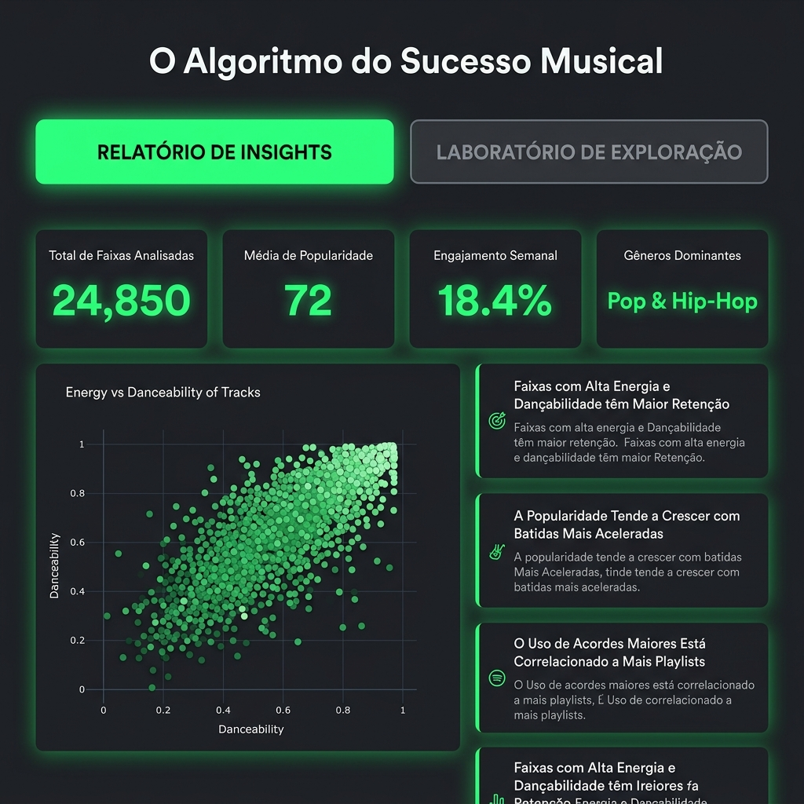
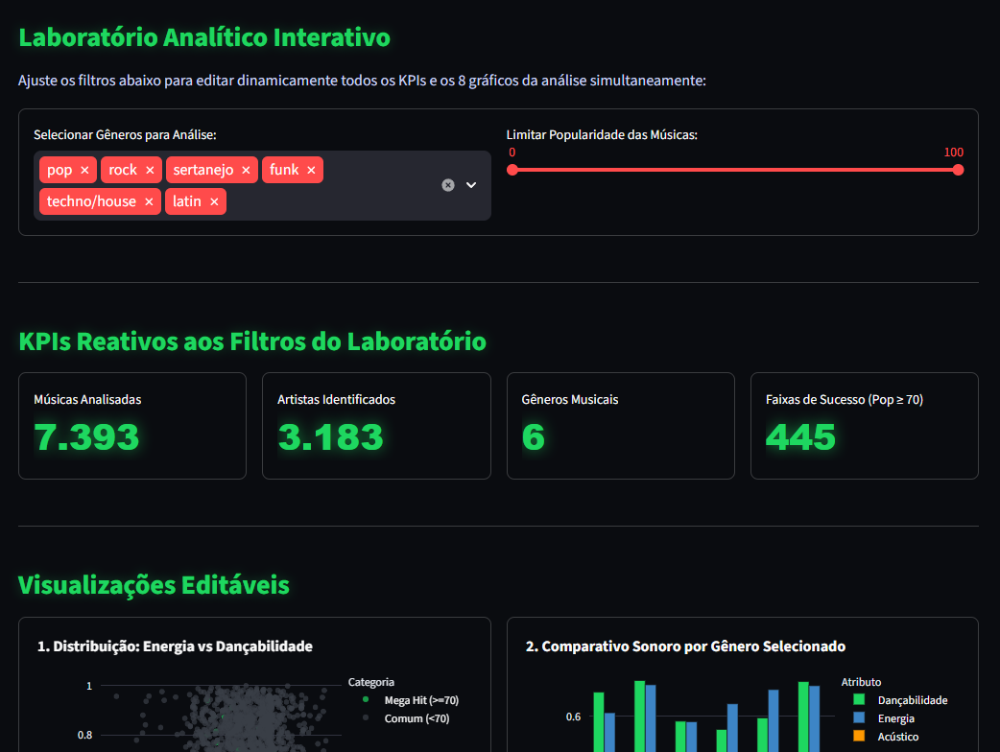

# O Algoritmo do Sucesso Musical
Investigação do DNA sonoro dos maiores hits do Spotify usando Python, SQL, Machine Learning e Streamlit.

## Contexto
Milhares de faixas são lançadas diariamente, mas apenas uma fração chega ao topo das paradas. Este projeto analisa os atributos técnicos de áudio de mais de 114 mil faixas do Spotify para entender o que diferencia um hit de uma música comum — e se é possível prever esse sucesso com dados.

## Stack
Python · Pandas · SQLite · SQLAlchemy · Scikit-learn · Streamlit · Plotly

## Fonte de Dados
[Spotify Tracks Dataset](https://www.kaggle.com/) — 114 mil faixas com atributos de áudio extraídos da API oficial do Spotify: `danceability`, `energy`, `valence`, `tempo`, `loudness` e `acousticness`.

## Metodologia
1. **Coleta** — download e leitura do CSV bruto via pandas
2. **Modelagem relacional** — banco SQLite com três tabelas: `artistas`, `faixas` e `atributos_audio`
3. **ETL** — tratamento de nulos, normalização de tipos e carga via SQLAlchemy
4. **Limpeza de gêneros** — consolidação de micro-gêneros redundantes em macro-categorias via SQL
5. **Machine Learning** — `RandomForestClassifier` para identificar os atributos mais decisivos para o sucesso de uma faixa
6. **Dashboard** — aplicação web interativa com Streamlit e Plotly, com três seções: Relatório Mundial, Relatório Nacional e Laboratório de Exploração

## Tópicos Analisados
1. Atributos de áudio com maior peso na previsão de sucesso de uma faixa
2. Padrão sonoro de hits versus não-hits nas paradas globais
3. Comparativo do perfil sonoro entre funk, hip-hop, sertanejo e rock
4. Relação entre volume de masterização e performance comercial das faixas
5. Presença e relevância de músicas acústicas no mainstream atual
6. Performance de faixas com baixa valência (tom melancólico) nas paradas
7. Consistência de perfil sonoro no catálogo dos artistas mais presentes no chart

## Principais Insights
1. **DNA Sonoro por Gênero** — gêneros urbanos (hip-hop e funk) lideram em dançabilidade; gêneros orgânicos (sertanejo e rock) dependem mais de energia e intensidade
2. **Hits são upbeat** — músicas comuns têm dançabilidade média de 0.55; mega hits (popularidade > 70) sobem para 0.65 de dançabilidade e 0.66 de energia
3. **Dançabilidade é o atributo mais decisivo** — identificada pelo modelo de ML como a variável de maior peso para prever se uma faixa se tornará um hit
4. **Volume importa comercialmente** — hits tocam em média a -6.7 dB contra -8.5 dB das faixas comuns, comprovando o uso de masterizações mais altas para capturar atenção
5. **O acústico perde espaço no mainstream** — o índice de acousticness cai de 0.33 em músicas comuns para 0.22 em hits, consolidando o domínio de produções digitais
6. **Música melancólica tem nicho** — faixas com baixa valência encontram maior aceitação em gêneros como alt-rock e indie, onde o público é receptivo a esse tom
7. **O efeito Bad Bunny** — artistas de elite sustentam popularidade média alta (85.3) em catálogos volumosos, sugerindo que o algoritmo amplifica quem já tem consistência

## Relatório Nacional
Seção dedicada à música brasileira, com análise de sertanejo, funk, forró, samba, pagode e MPB:
- Comparativo de dançabilidade, energia e acousticness por gênero nacional
- Distribuição de BPM por gênero (boxplot)
- Popularidade média por gênero nas playlists do Spotify

## Laboratório de Exploração
Ambiente interativo onde o usuário filtra gêneros e faixa de popularidade e atualiza em tempo real 8 visualizações, incluindo dispersão energia × dançabilidade, distribuição de volume, ranking de artistas e distribuição de valência.

## Demonstração Visual

### Relatório de Insights de Mercado


### Laboratório de Exploração Interativo


## Como Rodar Localmente
```bash
# 1. Clonar o repositório
git clone https://github.com/seu-usuario/algoritmo-sucesso-musical

# 2. Instalar dependências
pip install -r requirements.txt

# 3. Processar os dados (execute apenas uma vez)
python src/02_download_dataset.py   # download do dataset bruto
python src/03_carregar_banco.py     # cria e popula o banco SQLite
python src/09_limpeza_generos.py    # consolida micro-gêneros

# 4. Iniciar o dashboard
streamlit run src/08_dashboard_interativo.py
```
O app abre automaticamente em `http://localhost:8501`.
